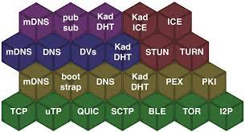

# IPFS Basics

## Understanding libp2p



IPFS is built on top of libp2p, a modular p2p networking stack. Libp2p is a collection of building blocks
that work very well together to solve many challenges that p2p implementations face, these building blocks can be split in different categories,
at the bottom of the networking stack are different transport implementations, so data transport can happen via, for example:
* tcp sockets
* udp sockets
* webRTC
* tcp + the quic
* websockets
* TOR
* etc..

There are also helpers for things like [UPnP hole-punching](https://en.wikipedia.org/wiki/Universal_Plug_and_Play) or circuit-relay servers
to make a libp2p host is visible to others even behind NAT.

One layer above there are different Discovery methods that help nodes find each other, such as [mDNS](https://en.wikipedia.org/wiki/Multicast_DNS), or the most often implemented [Kademlia distributed hash table](https://en.wikipedia.org/wiki/Kademlia).
To use connections most efficiently, libp2p also has a Interface for [Stream Multiplexing](https://docs.libp2p.io/concepts/stream-multiplexing/) that allows it to reuse
a single ( websocket - for example ) connection and split it into multiple logical connections.

On the very top of the Networking stack, one can implement different Protocols, IPFS nodes use 2 Protocols that we are interested in:
* [The bitswap protocol](https://docs.ipfs.io/concepts/bitswap/) for exchanging Files between node
* [a pubsub protocol](https://github.com/libp2p/specs/tree/master/pubsub/gossipsub) that lets nodes publish and subscribe to certain topics

### libp2p peer ID's

any node on a libp2p network has an identity, or peer-ID, because a node can run multiple protocols at the same time,
and might change the address by which it is visible to others ( behind NAT / dynamic IPS ), it is not enough to simply advertise
an endpoint to others, instead, nodes generate a keypair, and peers keep track of each other via their public key.
a libp2p peer-ID looks something like this: `12D3KooWKpNTJYurmMnoVpLaMoiJTKHjYifeMm4BHMpNrgcWpRH2`, a node that would like to connect to this peer
would ask a discovery mechanism to provide it with known multiAddresses of this peer, and then chose one of them to connect to.
multiAddresses contain information about where a node is reachable, and by what protocol, for example one libp2p host might have the following
Addresses, but only one identity / peer ID :


```
/ip4/127.0.0.1/tcp/4001/p2p/12D3KooWKpNTJYurmMnoVpLaMoiJTKHjYifeMm4BHMpNrgcWpRH2
/ip4/127.0.0.1/udp/4001/quic/p2p/12D3KooWKpNTJYurmMnoVpLaMoiJTKHjYifeMm4BHMpNrgcWpRH2
/ip4/172.17.0.2/tcp/4001/p2p/12D3KooWKpNTJYurmMnoVpLaMoiJTKHjYifeMm4BHMpNrgcWpRH2
/ip4/172.17.0.2/udp/4001/quic/p2p/12D3KooWKpNTJYurmMnoVpLaMoiJTKHjYifeMm4BHMpNrgcWpRH2
/ip4/113.3.34.214/udp/61401/quic/p2p/12D3KooWKpNTJYurmMnoVpLaMoiJTKHjYifeMm4BHMpNrgcWpRH2
/ip6/e6fd:408f:e4cd:84e4:8f73:e413:b1e4:addf/udp/61434/quic/p2p/12D3KooWKpNTJYurmMnoVpLaMoiJTKHjYifeMm4BHMpNrgcWpRH2
```

Now that you understand the basics of how the IPFS network works, we recommend you learn
about [how we use libp2p in tipfs](p2p_in_ipfs.md)


